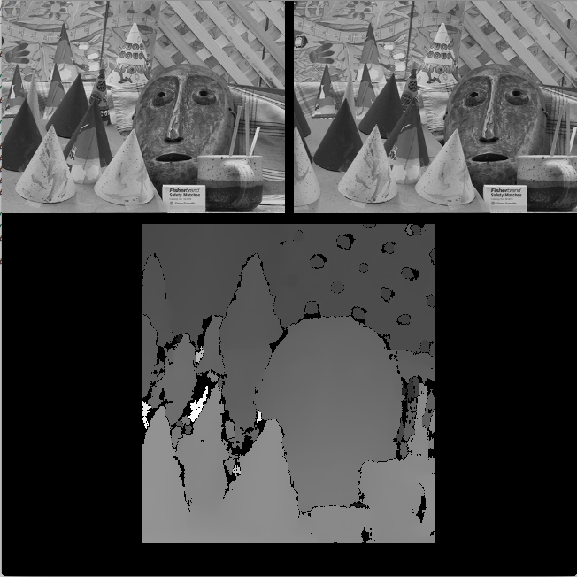

#Stereo Block Matching Depth Map

The images used for this testing are from the [Middlebury Stereo dataset.](http://vision.middlebury.edu/stereo/)

[Here is a basic explanation](http://docs.opencv.org/3.1.0/dd/d53/tutorial_py_depthmap.html#gsc.tab=0) from OpenCV how depth maps are created from stereoscopic images.

